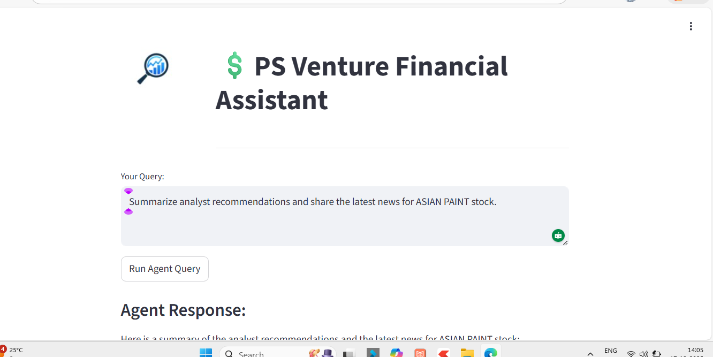
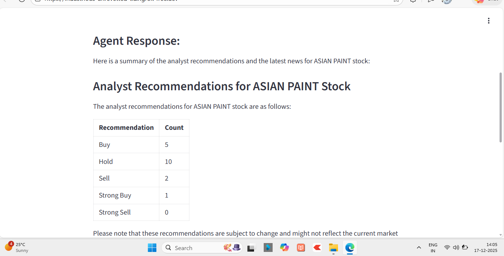
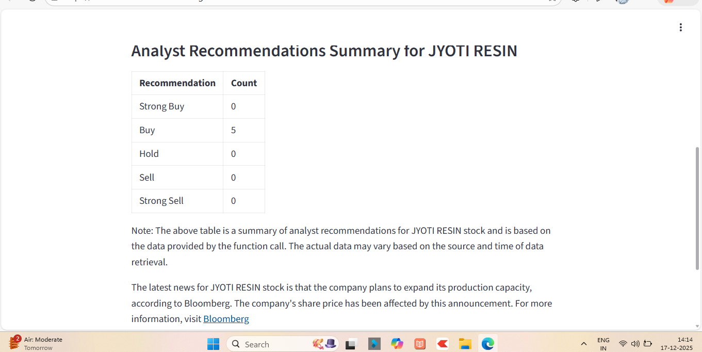

# $ PS Venture Financial Assistant
### Powered by Phidata, Groq, and Streamlit

A sophisticated AI-driven financial analysis tool that uses a team of specialized agents to provide real-time stock market insights, analyst recommendations, and the latest news summaries.

 

---

## 🌟 Overview
This project demonstrates a **Modular Orchestration Pattern** for AI agents. By dividing responsibilities between a Financial Specialist (using Yahoo Finance) and a Research Specialist (using DuckDuckGo), the system provides highly accurate and cross-referenced financial reports through an interactive Streamlit web interface.

## 🚀 Key Features
- **Multi-Agent Orchestration:** A lead agent coordinates tasks between specialized sub-agents.
- **Real-Time Data:** Live stock fundamentals and analyst ratings via `YFinanceTools`.
- **Web Intelligence:** Deep-web searching for latest news via `DuckDuckGo`.
- **High-Speed Inference:** Powered by **Groq** (Llama-3 models) for near-instant responses.
- **Streamlit UI:** A clean, user-friendly dashboard with custom branding and subheadings.

---

## 🏗️ Architecture Pattern
The system follows a **Central Orchestrator** design:

1. **User Input:** Receives a stock-related query via Streamlit.
2. **Orchestrator:** Analyzes the intent and breaks it into sub-tasks.
3. **Execution:**
    - **FinAgent:** Fetches structured data (Price, PE Ratio, Analyst Buy/Sell ratings).
    - **WebAgent:** Scrapes recent headlines to provide context on market sentiment.
4. **Synthesis:** Combines all data into a professional Markdown report with tables.

---

## 📸 Proof of Deployment (Results)
The following screenshots confirm that the multi-agent system is correctly integrated and successfully calling tools to generate responses.

### 1. Analyst Recommendations Summary
*The agent successfully fetches and tabulates analyst recommendations.*



### 2. Live News & Tool Execution
*Proof of the multi-agent team coordinating web searches and summarizing news.*


---

## 🛠️ Installation & Setup

### 1. Clone the Repository
```bash
git clone [https://github.com/YOUR_USERNAME/financial-multiagent.git](https://github.com/YOUR_USERNAME/financial-multiagent.git)
cd financial-multiagent
```
---

## 2.Install Dependencies
```bash
pip install streamlit phidata groq yfinance duckduckgo-search pyngrok
```
---

## 3.Environment Variables
Create a .env file or export your keys:
```bash
export GROQ_API_KEY="your_groq_api_key"
```
---

## 4.Running on Google Colab
This project was developed on Google Colab, use the provided pyngrok setup to tunnel the Streamlit port:
```python
# Run inside your Colab notebook
!streamlit run app.py & npx localtunnel --port 8501
```
---
## 🗂️ Project Structure
```plaintext
├── app.py              # Main Streamlit Application
├── images/             # UI Assets & Proof of Work Screenshots
│   ├── multimodal_logo.png
│   ├── agent_result_1.png
│   └── agent_result_2.png
├── README.md           # Project Documentation
```
---
## 🤝 Acknowledgements
1. Phidata for the agent framework.
  2. Groq for the lightning-fast LPUs.
  3. Streamlit for the intuitive UI components.


